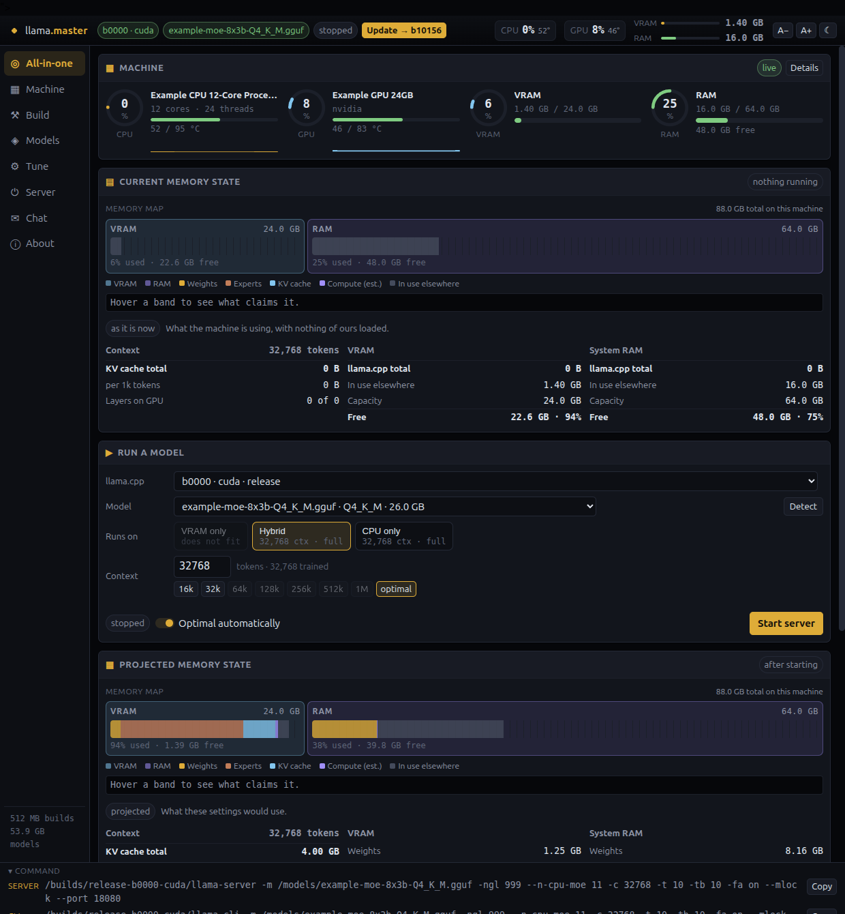

# llama.master

A desktop app for [llama.cpp](https://github.com/ggml-org/llama.cpp): get it,
find your models, work out what will actually fit, run it, talk to it.

llama.cpp is excellent and its command line is long. The two questions that cost
the most time are _"which build do I need on this machine?"_ and _"will this
model fit, and at what context?"_ — this answers both, with real numbers, before
anything is started.



<sub>Screenshot taken in demo mode (`LLAMA_MASTER_DEMO=1`): the machine, the
models and the build shown in it are fictional.</sub>

> **0.1.3.** Developed and tested on Linux/x86_64 with NVIDIA and AMD hardware.
> The macOS and Windows paths are implemented but have not been run by the
> author; see [Status](#status).
>
> _Since 0.1.1:_
>
> - **Speculative decoding, on by default where the model supports it.** A model
>   that ships a multi-token-prediction block (`nextn_predict_layers`) now gets
>   `--spec-type draft-mtp` as part of optimal settings. It is lossless by
>   construction — the full model verifies every drafted token, so the output is
>   exactly what it would have been and only the speed changes — and the block
>   is loaded either way, so leaving it off paid for it and got nothing. Never
>   set for a model without one: llama.cpp refuses to load, and the control says
>   so rather than offering a flag that cannot work.
> - **Every dropdown showed the wrong value.** Flash attention displayed `auto`
>   while `-fa on` ran; the KV cache type showed `f32` while `q8_0` ran. The
>   settings were right and the page was misreporting them, which is the exact
>   opposite of what this app promises. Found only by reading a live client —
>   the in-process test harness did not reproduce it.
> - **Prerequisites and Storage are their own pages.** Storage says which of the
>   disk is _ours_ — `df` tells you a disk is full, not that 40 GB of it is
>   three builds you stopped using.
> - **The all-in-one page fits one window**, with chat as a full-height column
>   beside the numbers rather than a panel below them.
> - **Estimated tokens/second**, with a meter banded on reading speed: under 5
>   tok/s you wait for the model, over 20 it outruns your eyes. Bytes-per-token
>   are exact; the bandwidth starts from a labelled default and calibrates from
>   your first real reply.
> - **Context has named Min / Opt / Big / Max sizes** and a drawn usable range,
>   on both the all-in-one and Tune pages. Only Max is read from the model; the
>   rest are marked `≈`.
> - Per-method performance budgets replace one global ceiling, and the memory
>   plan accounts for the MTP draft context before it is enabled.

## What it does

**Gets llama.cpp.** Prebuilt release or built from source, for CPU, CUDA,
Vulkan, ROCm or Metal. It works out whether the build you picked can actually
succeed _before_ enabling the button — a missing `nvcc`, a CUDA toolkit older
than your GPU, Vulkan without SPIRV-Headers — and when something can be
installed for you, it offers to, showing the exact command first.

**Finds your models.** Plain `.gguf` trees, LM Studio, and ollama — including
ollama's blob store, which contains no `.gguf` files at all and is only
navigable through its manifests.

**Says what will fit.** The GGUF header is parsed in Rust and walked
tensor-by-tensor, so weights, routed experts and KV cache are counted exactly
rather than estimated — including sliding-window and MLA attention, which a
uniform formula overstates several-fold. Only the compute buffer is an estimate,
and it is labelled as one everywhere it appears.

**Chooses settings.** One set of optimal settings; you choose _where_ the model
runs:

|               |                                                                                                                                                         |
| ------------- | ------------------------------------------------------------------------------------------------------------------------------------------------------- |
| **VRAM only** | Every layer on the GPU. Fastest, and bounded by the card.                                                                                               |
| **Hybrid**    | GPU for what fits, RAM for the rest. On a mixture-of-experts model the routed experts move first — they are most of the bytes and least of the latency. |
| **CPU only**  | No GPU. Works anywhere.                                                                                                                                 |

Each aims at the model's **trained context** — the longest context at which it
still performs as designed — and takes the largest that fits without exceeding
it. The picker shows what each placement would give, so a placement that cannot
run this model says so instead of failing at load.

**Runs it, and tells the truth about it.** One model at a time. While it runs,
the memory view describes _that process_, computed from the command it was
started with and shown next to its measured RSS — not a projection of whatever
has since been typed into the form. A server that dies is diagnosed from its own
output ("the GPU ran out of memory", with the stray process still holding the
VRAM offered up for stopping), never as a bare exit code.

## Requirements

- **Linux, macOS or Windows** on x86_64 or arm64
- **[Deno](https://deno.com) 2.9+**
- Nothing else. CMake and SPIRV-Headers are downloaded into the app's own
  directory when a source build needs them; a prebuilt release needs no
  toolchain at all.

A GPU is optional — CPU only is a first-class placement, not a fallback.

## Running it

llama.master vendors the [aio](https://github.com/riagentic/aio) framework by
symlink rather than as a package, so clone the two side by side. **aio
`1.0.0-alpha38` or newer is required** — earlier versions do not export
`appDirs` from `aio/server` and the app will not type-check:

```sh
git clone https://github.com/riagentic/aio.git
git clone https://github.com/riagentic/llama-master.git
cd llama-master
mkdir -p dep && ln -s ../../aio dep/aio

deno task install:electron   # once — allows electron's postinstall to run
deno task dev                # the desktop app
```

Other entry points:

```sh
deno task dev:browser                 # the same app in a browser tab
LLAMA_MASTER_DEMO=1 deno task dev     # fictional machine and models, for a look around
```

Everything the app writes lives in `~/.llama-master/` — `data/files/builds/`
holds the llama.cpp builds it installed, and `cache/` holds downloads and source
trees and can be deleted at any time. Set `LLAMA_MASTER_HOME` to put it
elsewhere (builds are gigabytes).

## Status

Honest about what has and has not been exercised:

- **Linux/x86_64** — developed here. CPU, CUDA and Vulkan built from source and
  run; CPU, Vulkan and ROCm installed from prebuilt releases and run. Real
  models up to 39 GB, real inference.
- **macOS / Windows / arm64** — the code paths exist and are unit-tested, but
  nothing has been run on that hardware. Reports welcome.
- **Metal** — refused with an explanation off Apple hardware; untested on it.

## Development

```sh
deno task test          # the test suite
deno task test:rust     # the Rust core
deno task wasm          # rebuild src/llama-sys.wasm after editing rust/
deno task verify        # fmt · lint · check · test — the pre-merge gate
deno task am state hw   # inspect the running app
```

The app mark lives in `src/icon.svg`; the packagers read `src/icon.png`, so
re-export it after editing the SVG (a guard test fails if the PNG is older):

```sh
inkscape --export-type=png --export-filename=src/icon.png -w 512 -h 512 src/icon.svg
```

Architecture, and the decisions worth knowing before changing anything, are in
[CLAUDE.md](CLAUDE.md): `src/lib/` is pure and holds every rule, `src/cell/` is
state, `src/ui/` is presentation, and the boundaries between them are
load-bearing.

## Credits

The engine is [llama.cpp](https://github.com/ggml-org/llama.cpp) by Georgi
Gerganov and its contributors — all inference, and every binary this app builds
or installs, is theirs. This is a front end.

Built on [aio](https://github.com/riagentic/aio).

## License

MIT — see [LICENSE](LICENSE).
